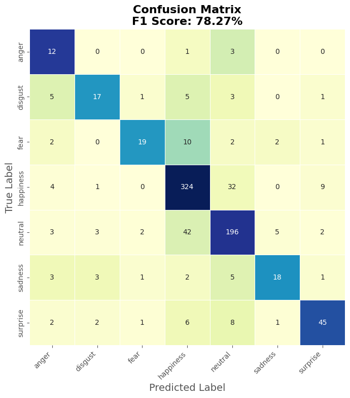
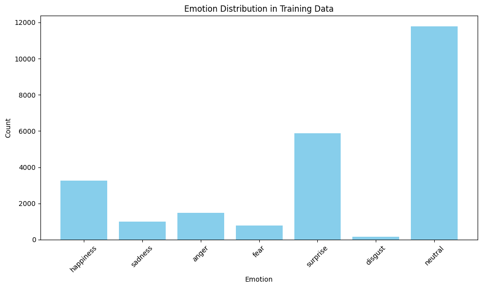

# **Model Card**

## Model Details

- **Developed by:** Breda University of Applied Sciences, DS & AI, Group 21  
  *Soheil Mohammadpour, Ron Lev Tabuchov, Viktória Kubišová*
- **Model date:** April 6, 2024
- **Model version:** 5 (Iteration 5 as indicated in the code)
- **Model type:** Fine-tuned DeBERTa-v3-xsmall (`microsoft/deberta-v3-xsmall`)
- **Hardware used for training:**
  - GPU: RTX 3060 (6GB VRAM)
  - RAM: 32GB
  - CPU: Intel i7 (11th Gen, 8 cores)
- **Training time:** 16 minutes 55 seconds
- **Training algorithms and parameters:**
  - Base model: DeBERTa-v3-xsmall (12 layers, 6 attention heads, 384 hidden size)
  - Custom multi-task classifier (`BERTClassifier5`) with hidden dimension of 256
  - Feature enrichment: TF-IDF and EmoLex lexicon features
  - Dropout rate: 0.1
  - Epochs: 6
  - Batch size: 32
  - Max sequence length: 128 tokens
- **License:** Same as base model (`microsoft/deberta-v3-xsmall`)

## Intended Use

- **Primary intended uses:**  
  Multi-label emotion classification from text with three outputs:
  1. Main emotion category (7 classes)
  2. Sub-emotion (28 specific categories)
  3. Emotion intensity (mild, moderate, strong)

- **Primary intended users:**  
  Researchers and developers working on emotion analysis in text.

## Factors

- **Relevant factors:**  
  Text language, cultural context, domain-specific language.

- **Evaluation factors:**  
  Performance across different emotion categories and intensity levels.

## Metrics

- **Overall performance:**
  - F1 Score: 0.7827
  - Precision: 0.7883
  - Recall: 0.7839
  - Accuracy: 0.7839

- **Per-class metrics:**
  - **Happiness:** F1 0.85, Precision 0.83, Recall 0.88
  - **Neutral:** F1 0.78, Precision 0.79, Recall 0.77
  - **Surprise:** F1 0.73, Precision 0.76, Recall 0.69
  - **Fear:** F1 0.63, Precision 0.79, Recall 0.53
  - **Sadness:** F1 0.61, Precision 0.69, Recall 0.55
  - **Disgust:** F1 0.59, Precision 0.65, Recall 0.53
  - **Anger:** F1 0.51, Precision 0.39, Recall 0.75

  

## Data

- **Dataset Overview**:  
  The dataset is derived from YouTube show transcriptions, processed by the Content Intelligence Agency's pipeline. It provides a comprehensive representation of various emotional expressions captured in natural language.

- **Original Data Source**:  
  The data originates from YouTube show transcriptions, ensuring a diverse and authentic collection of emotional dialogues.

- **Dataset Size**:  
  The dataset consists of 24,000 rows, with an additional 61,018 sentences generated to enhance class balance, resulting in a robust dataset for training and evaluation.

- **Train/Validation/Test Split**:  
  The dataset was divided into training and test sets using a 90/10 split. The test set comprises 860 rows, ensuring a representative sample for evaluating model performance.

- **Classes and Distribution**:  
  The dataset includes seven primary emotion classes, each with a distinct number of samples:
  - **Happiness**: 3,260 samples
  - **Sadness**: 990 samples
  - **Anger**: 1,473 samples
  - **Fear**: 775 samples
  - **Surprise**: 5,870 samples
  - **Disgust**: 150 samples
  - **Neutral**: 11,777 samples

    

  This distribution reflects the natural occurrence of emotions in the source material, with a visual representation provided in the accompanying model output image.

- **Preprocessing**:  
  Several preprocessing steps were applied to ensure data quality and consistency:
  - **Intensity Simplification**: Emotional intensity was categorized into three levels: mild, moderate, and strong.
  - **Sub-emotion Mapping**: Sub-emotions were consolidated into seven main categories, reducing complexity from 28 sub-emotions.
  - **Text Augmentation**: To address class imbalance, text augmentation was employed with a ratio of 2, effectively doubling the representation of underrepresented classes.
  - **Duplicate Removal**: Duplicates were identified and removed to maintain data integrity.
  - **Missing Values**: Any missing values were systematically removed to ensure a complete dataset.

- **Data Quality**:  
  The dataset underwent rigorous cleaning to eliminate noise and ensure high-quality inputs for model training. This included the removal of duplicates and missing values, as well as the application of augmentation techniques to balance class representation.

- **Ethical Considerations**:  
  The dataset was anonymized to protect individual privacy. Efforts were made to ensure a balanced representation of emotions, minimizing potential biases and ensuring ethical use of the data.

- **Limitations**:  
  While the dataset is extensive, it may not fully capture the subtleties of all emotional expressions due to the inherent limitations of transcription data. Additionally, the class imbalance, despite augmentation efforts, may still impact model performance on less represented emotions.

- **References**:  
  For further details on the dataset and its processing, please refer to the Content Intelligence Agency's documentation and related publications.

This expanded section provides a thorough understanding of the dataset, its preparation, and the considerations taken into account, offering valuable context for interpreting the model's performance and applicability.

## Quantitative Analyses

- **Unitary results:**  
  - Best performance: Happiness (F1 0.85) and Neutral (F1 0.78)
  - Lower performance: Anger (F1 0.51)

- **Class imbalance:**  
  - Happiness: 370 samples
  - Neutral: 253 samples
  - Anger: 16 samples

## Error Analysis

The error analysis revealed significant improvements in class balance and prediction diversity during the model iterations. Misclassifications were no longer dominated by a single error type, with the confusion matrix showing a more even distribution of mistakes. Confusion between neutral and happiness decreased, and there were fewer false positives. These improvements indicate that data augmentation and the use of a more diverse test set helped the model better distinguish between similar emotional expressions. While neutral remained a challenging class, the overall bias toward it was reduced, and the model demonstrated stronger performance across varied input lengths, contributing to better robustness and generalization.

For more comprehensive report on Error Analysis, please refer to this link: <a href="https://github.com/BredaUniversityADSAI/2024-25c-fai2-adsai-group-group21/blob/main/task%208%20-%20Error%20analysis/Error_Analysis.pdf">Error Analysis.pdf</a>

## XAI

This analysis investigates the interpretability of transformer model used for emotion classification. Multiple XAI techniques were applied to understand how the model makes decisions, including Gradient × Input, Conservative Propagation (LRP), and attention score visualizations.

### Key Methods

1. **Gradient × Input**: This method highlights token contributions based on the gradient of the model's output. It focuses on emotion-inducing words and punctuation, with red indicating negative and green indicating positive contributions to the prediction. The model handles emotional contradictions effectively, where negations like "do not" alter sentiment analysis.

2. **Conservative Propagation (LRP)**: LRP distributes attribution more evenly across all tokens, including special tokens like [CLS] and [SEP], which helps in understanding the broader context of sentence structure. This method shows a more uniform distribution of attribution compared to Gradient × Input and emphasizes the relationships between all tokens within the sentence, identifying emotion-specific patterns.

3. **Comparison of Methods**: While Gradient × Input focuses on emotionally charged words, LRP considers all tokens, regardless of their emotional intensity. These methods often show low agreement, revealing that they capture different aspects of the model’s reasoning process. Gradient × Input tends to emphasize specific emotional words, whereas LRP looks at the overall token relationships.

4. **Model Robustness**: The analysis of token removal strategies reveals that confidence in predictions is affected by which tokens are removed. Emotion-specific patterns emerge, with some tokens causing significant shifts in prediction confidence, while others have minimal effect. The model's confidence trajectory is non-linear, indicating complex interdependencies between tokens.

5. **Attention Score Visualization**: Each emotion shows distinct attention patterns. For instance, Anger emphasizes emotional words, while Fear focuses on threat-related terms. Confidence in predictions is associated with stronger attention scores on relevant tokens. These visualizations show that the model focuses on both local and long-range dependencies, capturing the context of emotional language.

Transformer-based emotion classification models demonstrate sophisticated contextual understanding, identifying emotion-specific patterns and interdependencies within the text. The combination of XAI methods like Gradient × Input, LRP, and attention visualizations provides valuable insights into model decision-making. However, the complexity of the model's internal workings highlights the need for multiple XAI strategies to gain a complete understanding of how emotions are classified. 

For more comprehensive report on XAI, please refer to this link: <a href="https://github.com/BredaUniversityADSAI/2024-25c-fai2-adsai-group-group21/blob/main/task%209%20-%20XAI%20for%20Transformers/DeBERTa/Explainable%20AI%20(XAI)%20Report.md">XAI Report.md</a>

## Ethical Considerations

- The model’s emotion predictions **should not** be used for clinical diagnosis.
- Performance varies across emotion categories, potentially leading to biased predictions for underrepresented emotions.

## Energy Consumption & Sustainability

### Training
During training, the model operates at approximately **170 W** of power consumption. For a typical training session of **17 minutes**, this results in a total energy use of approximately **0.05 kWh**. Extended training sessions of 3 hours consume around **0.51 kWh**.

### Inference
Inference requires less energy compared to training. Based on typical workloads, inference energy consumption is estimated to be **10–20% of training power**, approximately **20–40 W**, leading to an estimated **0.005–0.01 kWh** for 17 minutes of inference runtime.

In addition,rReducing energy consumption of the model can be achieved by using lower precision arithmetic, such as using 16-bit or 8-bit floating-point numbers instead of the standard 32-bit. This reduce the computational load and memory usage, leading to even lower energy consumption.

### Sustainability Assessment
Compared to large-scale AI models, this model maintains a lightweight energy profile and considered sustainable for standard use cases. Efficiency can be further optimized through hardware selection, batch processing, and responsible deployment practices.

Energy = 0.2833 h × 170 W ÷ 1000 = 0.048 kWh

## Caveats and Recommendations

- Lower performance on minority classes (anger, disgust).
- Additional data for underrepresented emotions is recommended to improve performance.
- Consider cultural context when interpreting emotion predictions.
