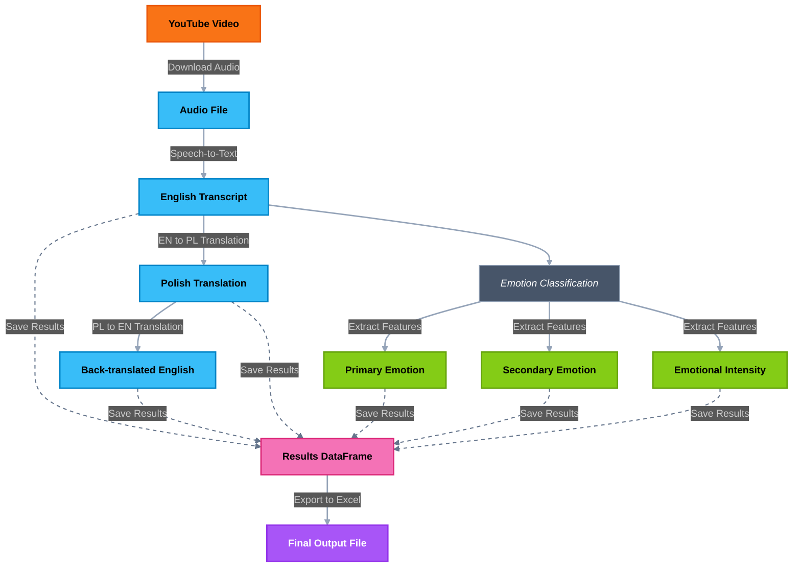

# Emotion Classification Pipeline

This project implements an end-to-end pipeline for emotion classification from speech data. The system processes raw video/audio data, transcribes speech to text, performs translations between English and Polish, and classifies emotions with their intensity levels.


<div align="center">


</div>


## Pipeline Workflow



## Project Structure

<div style="background-color: #2d333b; color: #adbac7; padding: 16px; border-radius: 8px; font-family: monospace;">

```
.
├── data/                 # Data storage 
│   ├── encoders/         # Model encoders
│   ├── features/         # Feature extraction data
│   ├── results/          # Final pipeline outputs
│   ├── transcription/    # Transcribed text data
│   └── youtube_audio/    # Downloaded audio files
├── models/               # Pre-trained model weights
├── notebooks/            # Jupyter notebooks for exploration
├── src/                  # Source code
│   ├── data.py           # Data loading and processing
│   ├── emotion_classifier.py # Emotion classification module
│   ├── pipeline.py       # Main pipeline implementation
│   ├── speech_to_text.py # Transcription module
│   └── translator.py     # Translation module
├── .env                  # Environment variables
├── requirements.txt      # Project dependencies
└── README.md             # Project documentation
```

</div>

## Installation

<div style="background-color: #f6f8fa; padding: 16px; border-radius: 8px; border-left: 4px solid #5C7CFA;">

1. Create and activate the environment:
```bash
conda create --name nlp_pipeline python=3.9
conda activate nlp_pipeline  
```
2. Install dependencies:
```bash
pip install -r requirements.txt 
```
3. Set up environment variables: Create a `.env` file with the necessary API keys.
```
ASSEMBLYAI_API_KEY=your_api_key_here
```

</div>

## Usage

<div style="background-color: #002b36; color: #839496; padding: 16px; border-radius: 8px; font-family: monospace;">

- Option 1: Basic command to run the pipeline with default settings
```bash
python src/pipeline.py
```

- Option 2: Command with custom arguments
```bash
python src/pipeline.py \
  --url "https://www.youtube.com/watch?v=ZDsfeIyjZUM"  # YouTube video URL to download audio from
  --filename "top_models"                              # Filename for the downloaded audio (without extension)
  --transcription assemblyAI                           # Method for speech-to-text transcription (options: assemblyAI, whisper)
```

Upon completion, the pipeline produces an Excel file (at `./data/results/results.xlsx`) with the following columns:

<div style="display: flex; justify-content: center; margin-top: 16px;">
<table style="width: 90%; border-collapse: collapse; border-radius: 8px; overflow: hidden; box-shadow: 0 4px 8px rgba(0,0,0,0.1);">
  <tr style="background-color: #5C7CFA; color: white;">
    <th style="padding: 12px;">Start Time</th>
    <th style="padding: 12px;">End Time</th>
    <th style="padding: 12px;">Sentence</th>
    <th style="padding: 12px;">Polish Translation</th>
    <th style="padding: 12px;">English Translation</th>
    <th style="padding: 12px;">Emotion</th>
    <th style="padding: 12px;">Sub Emotion</th>
    <th style="padding: 12px;">Intensity</th>
  </tr>
  <tr style="background-color: #f8f9fa;">
    <td style="padding: 8px; border-bottom: 1px solid #ddd;">00:00:01</td>
    <td style="padding: 8px; border-bottom: 1px solid #ddd;">00:00:05</td>
    <td style="padding: 8px; border-bottom: 1px solid #ddd;">I'm so excited about this project!</td>
    <td style="padding: 8px; border-bottom: 1px solid #ddd;">Jestem tak podekscytowany tym projektem!</td>
    <td style="padding: 8px; border-bottom: 1px solid #ddd;">I am so excited about this project!</td>
    <td style="padding: 8px; border-bottom: 1px solid #ddd;">Happiness</td>
    <td style="padding: 8px; border-bottom: 1px solid #ddd;">Excitement</td>
    <td style="padding: 8px; border-bottom: 1px solid #ddd;">Strong</td>
  </tr>
  <tr style="background-color: #ffffff;">
    <td style="padding: 8px; border-bottom: 1px solid #ddd;">00:00:05</td>
    <td style="padding: 8px; border-bottom: 1px solid #ddd;">00:00:07</td>
    <td style="padding: 8px; border-bottom: 1px solid #ddd;">I can't believe this happened.</td>
    <td style="padding: 8px; border-bottom: 1px solid #ddd;">Nie mogę uwierzyć, że to się stało.</td>
    <td style="padding: 8px; border-bottom: 1px solid #ddd;">I can't believe this happened.</td>
    <td style="padding: 8px; border-bottom: 1px solid #ddd;">Surprise</td>
    <td style="padding: 8px; border-bottom: 1px solid #ddd;">Disbelief</td>
    <td style="padding: 8px; border-bottom: 1px solid #ddd;">Moderate</td>
  </tr>
  <tr style="background-color: #f8f9fa;">
    <td style="padding: 8px;">00:00:07</td>
    <td style="padding: 8px;">00:00:09</td>
    <td style="padding: 8px;">This makes me feel a bit sad.</td>
    <td style="padding: 8px;">To sprawia, że czuję się trochę smutny.</td>
    <td style="padding: 8px;">This makes me feel a bit sad.</td>
    <td style="padding: 8px;">Sadness</td>
    <td style="padding: 8px;">Disappointment</td>
    <td style="padding: 8px;">Mild</td>
  </tr>
</table>
</div>


<div align="center">
  
</div>

<br>

<div align="center" style="background-color: #f8f9fa; padding: 20px; border-radius: 10px; margin-top: 20px;">
  <p style="font-size: 14px; color: #5c5c5c;">
    <strong>Group 21 - ADSAI, FAI2 2024-25</strong><br>
    Pipeline for Emotion Classification
  </p>
  
</div>


