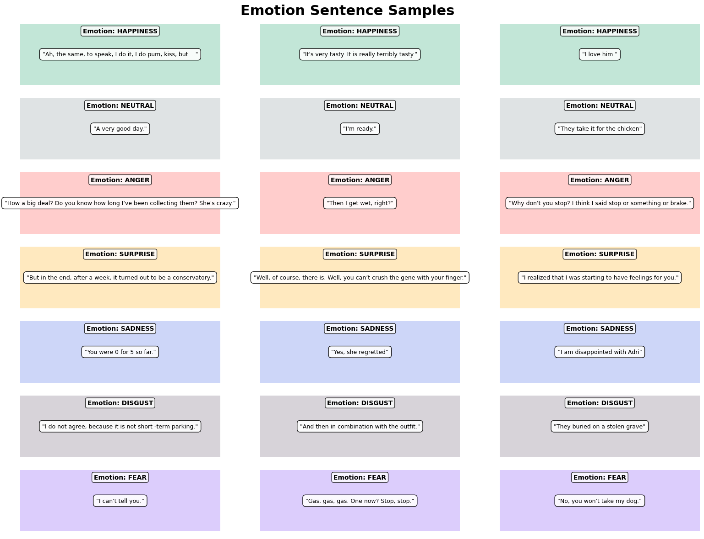
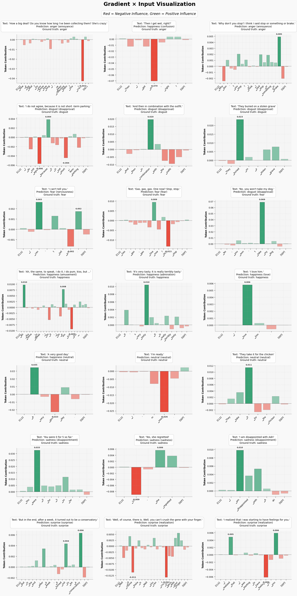
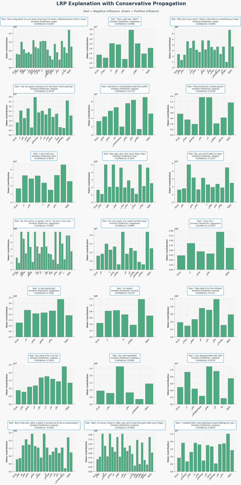
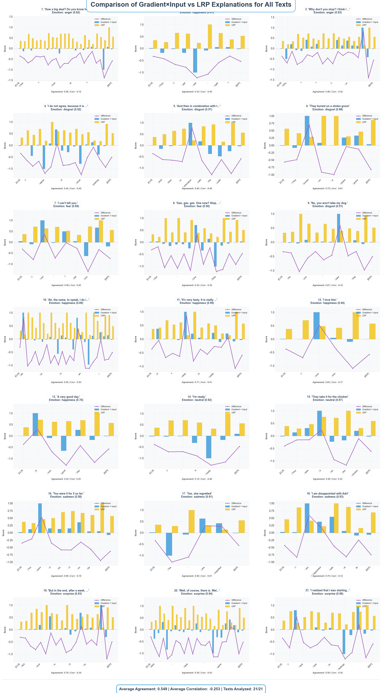
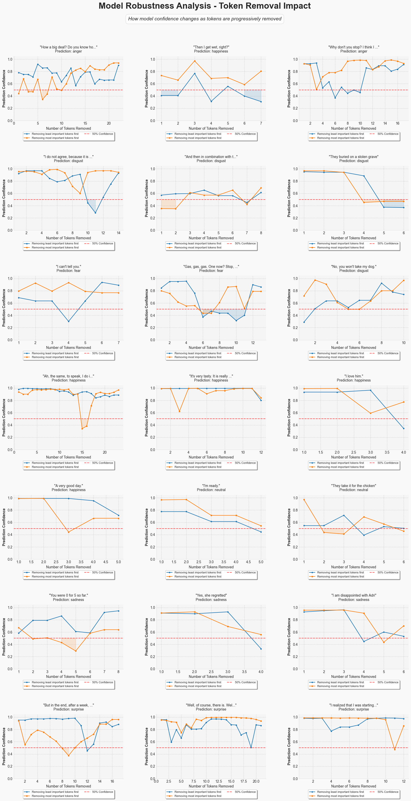
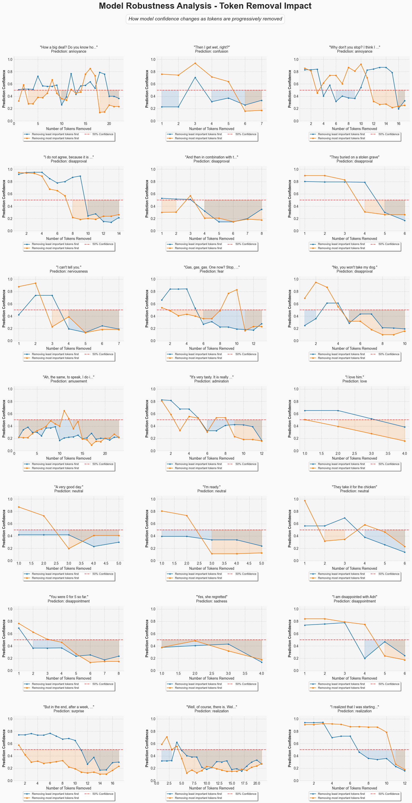
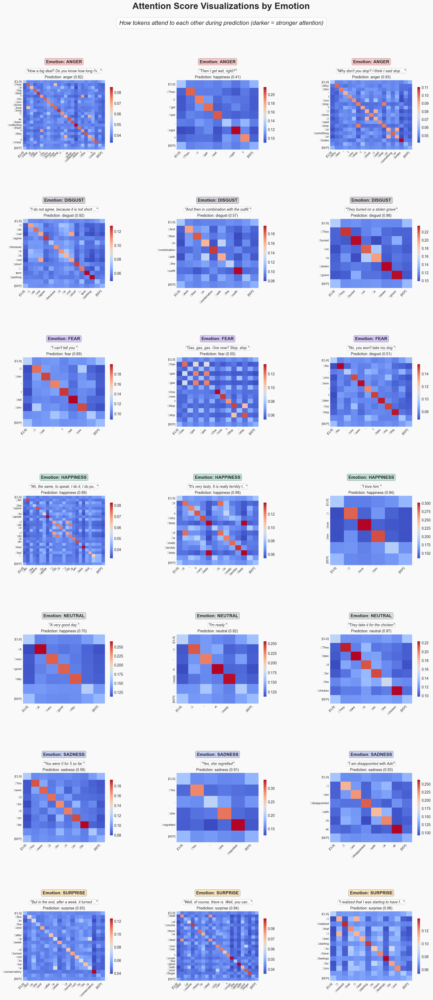

<h1 style="text-align:center;">  Explainable AI (XAI) for Transformer-Based Emotion Classification</h1>

 

# Table of Contents

- [Introduction](#1-introduction)
- [Methodology](#2-methodology)
- [Results and Analysis](#3-results-and-analysis)
  - [Gradient × Input Analysis](#31-part-1-gradient--input-analysis)
  - [Conservative Propagation (LRP)](#32-part-2-conservative-propagation-lrp-analysis)
  - [Comparison of Methods](#33-comparison-of-gradient--input-vs-lrp-explanations)
  - [Model Robustness Analysis](#34-part-3-model-robustness-with-input-perturbation)
  - [Attention Visualization](#35-attention-score-visualization)
- [Conclusion](#4-conclusion)

 

# 1. Introduction

In this report, we examine the XAI interpretability of a transformer model emotion classification. For tasks such as emotion classification, which rely upon deep contextual understanding within language, along with multi faceted clues in dialogue, explainability becomes key because model decisions need to be reasoned. We use a variety of XAI methods to examine how our models across the six emotions: Happiness, Neutral, Anger, Surprise, Sadness, Fear.

The strategy that is being followed is that of Ali A. et al. (2022) in '*XAI for Transformers: Better Explanations through Conservative Propagation*' where gradient methods as well as LRP based method have been used for calculating importance of tokens. In addition, we evaluate model explainability by conducting perturbation tests using token elimination as well as scrutinizing attention distribution.

 

# 2. Methodology

Our analysis examines 21 sentences (three per emotion category): 

It examines through three complementary XAI techniques:

| XAI Method | Description | 
| --- | --- | 
| Basic Gradient × Input | Multiplicative combination of input value with its corresponding token’s predicted output gradient. |
| Conservative Propagation (LRP) | Layer-wise attention guided backpropagation with conservative focus and normalization oversight. |
| Input Perturbation | Gradually token suppression to assess shifts in predicted probability. |

These methods collectively provide multifaceted insights into how our transformer model processes emotional text.

 

# 3. Results and Analysis

## 3.1 Part 1: Gradient × Input Analysis

Incremental shifts in prediction values from the Gradient × Input visualization showcase how varied tokens impact the model's predictions — **red** 🔴 indicating negative contributions, and **green** 🟢 signaling a positive influence to the predicted sentiment.

### **Key Patterns:**

- **Token Importance Distribution**: Words associated with emotions continue to have the greatest attribution values. Words such as *love* and *good* as well as *disappointed* have great impact toward their corresponding emotion classifications. Exclamation marks and question marks, along with other forms of punctuation, frequently display high attribution weights, so the model is likely to be able to understand their emotional signaling purpose.

- **Emotion-Specific Attribution**: The emotion categories employ different attribution strategies. Concerning a happy disposition, words like *love* and *good* popularly predict alongside *tasty* and *very* which are also positively framed. Terms like *stop* and *take* are heavily relied upon for fear classifications, while disgust predictions are tied with unpleasant or rejecting terms. For classifications of surprise the words that serve supporting roles like *turned out* and *realized* have great impact.

- **Contextual Understanding**: The model showcases complex sophisticated patterns support far beyond mere recognition of the meaning of words, which is clear thanks to the interplay between positions of words and grouping thereof along with attribution values. Tokons such as [SEP] attract distinctive levels of attribution importance that are unexpected, meaning that the model considers the boundaries of the sentences. More importantly, vague words are interpreted justifiably, considering the context around them.

- **Contradiction Handling**: In increasingly complex emotional signals, expletive phrases efficiently alter the emotional scope of the resultant words. For instance, "*do not*" utilized alters the perception towards modifying tone, illustrating intricate linguistic handling of nuance.

The model appears to understand emotional indicators beyond mark-word spotting, showcasing contextual understanding that identifies relevant emotion signifiers that change relative to the text's context.

## 3.2 Part 2: Conservative Propagation (LRP) Analysis

### All-around changes for more dynamic prose : 

The Layer wise Relevance Propagation approach using conservative propagation shows a higher attribution value than other approaches. This indicates that the value of influence each token has, within the context, is unique when compared with Gradient X Input. 

### **Primary Takeaways:**

- **Token Distribution Patterns**: There is a uniform distribution of positive and negative values across tokens. Almost all tokens receive positive attribution. This would be different than in Gradient X Input, as LRP allocates attribution more fairly across the entire input. Tokens that are special, meaning that they don’t belong to any groups such as ([CLS] and [SEP]) give high credits indicating their role in sentence understanding.

- **Scale Differences**: Difference in magnitude, as the values granted by LRP are estimated to be greater than those assigned by gradient X input. This effect is widespread and is noticeable in the emotion predictions streams whose values are close in comparison. 

- **Emotion-Specific Patterns****: A clear distinction of attribution along every category of emotion.anger shows close to the same level of token attributions while focusing on control words. higher estimates towards terms depicting positive emotions. With sadness this is marked by higher oscillation depicting multilinear. Surprise emphasizes transitions significant with indicators of contrast.

- **Contextual Understanding**: LRP pays attention to every token that may impact a prediction and makes little distinction between emotional and neutral words. The relations among dependencies between tokens are successfully represented, which is demonstrated by consistent attribution across phrases. The large attribution apportioned to certain tokens indicates some level of attention to structure and its impact on emotions.

Within LRP’s bounds, a more global perspective can be provided regarding the impact of tokens, implying that the model considers all utterances in the input instead of attending to one emotionally laden utterance. Such a strategy underscores the model’s ability to handle universal contextual dependencies.

## 3.3 Comparison of Gradient × Input vs. LRP Explanations

Analyzing both XAI methods side by side uncovers the different but often divergent frameworks and implications regarding importance of tokens which aid in understanding evaluated.

### **Key Comparison Insights:**

| Aspect | Gradient × Input | LRP |
| --- | --- | --- |
| **Attribution Distribution** | Selective with both positive and negative impact | Uniformly positive for all tokens |  
| **Focus** | Emotion Inducing Words | All Tokens Including Special Tokens |  
| **Agreement** | Varies (14-83%) | Varies (14-83%) |  
| **Simple Sentences** | Higher agreement (83%) | Higher agreement (83%) |  

- **Attribution Distribution**: Focuses on more emotionally charged tokens of interest. In contrast, with LRP, all tokens are treated as individuals contributing to a group prediction, with every token receiving positive attribution. 'Uniformly positive' means that attribution feedback is given equally, suggesting all Tokens focus on expected predictive contributions but at varying emphasis levels.  

- **Method Agreement**: Most examples fall below 50% in showing low agreement. Moderately contradicting patterns indicate lower attribution focus; some examples reveal negative correlations to each other. Negative correlations indicate attribution focus opposing positional intent. Simpler sentences (e.g., "*I love him*") show higher agreement of 83 percent and thus indicate alignment on more straightforward sentences.  

- **Top Token Disparities**: The strongest impact tokens on sentiment attribution are highlighted as “[emotion]”-focused words LRP assertively centers around emotion triggers (e.g. *“love”* *“stop”* *“agree”*). In contrast, top focus for LRP specialist devices is special tokens,…

- **Specific To Each Emotion Patterns**: For the prediction of anger, Gradient × Input highlighted emotionally informed words, while LRP shows equal attribution. The same divergence appears across other emotions, but Gradient × Input applies greater token hierarchies, and LRP distributes more uniformly.

Emphasizing the differences in Global Variable Methods has proven useful in understanding both sides. Gradient × Input provides focused answers by focusing emotionally salient tokens, while LRP adds attention over all variables by smoothing all away through the convoluted process. Consistent discord between models, as showcased here, delineate the need for multiple methodologies in XAI to fully understand the outcome.

### 3.4 Part 3: Model Robustness with Input Perturbation

The analysis of confidence reveals the model's token removal strategy, which in these cases two approaches are used to systematically remove tokens.
- 🔵 **Usage of blue lines**: By removing the least salient ones first.
- 🟠 **Usage of orange lines**: Starts white the most salient ones first.

#### **Key Findings:**

- **Variable Impact of Removal Strategies**: In sentences or paragraphs, most removed tokens, which are considered most salient, do result in greater changes of confidence – positive or negative – but this is not the case for all examples which makes it more complex, because some rather unimportant words sometimes cause greater shifts in confidence than anticipated.

- **Emotion-Specific Response Patterns**: Response examples display different robustness patterns with some being very responsive with high confidence shifts and others remaining with very minimal changes in confidence even after a lot of token removal. These discrepancies are not associated with categorization of emotions into specific classes.

- **Non-Linear Confidence Trajectories**: Confidence does tend to oscillate with an increase or decrease in tokens, thus, not having a definite pathway. It is striking that there are some instances of increase in confidence after certain tokens are removed, signaling the existence of deeper relations between tokens than mere additive contributions.

- **Threshold Resilience Variability:** The degree to which the model sustains a classification confidence exceeding 50% threshold gives the impression that there is significant variability in the examples, some drop abruptly while others remain sturdy no matter how many tokens are taken away.

This analysis reveals the discrepancies between the allocation of tokens in relation to the model’s confidence level as multifaceted. The mismatched results imply that the methods of attribution furnish significant insights into model reasoning, but not without flaws, highlighting the fact that importance of tokens is model specific.

### 3.5 Attention Score Visualization

The drawings indicate that each token has a specific role during the prediction period and stronger bonds are represented by darker colors.

#### **Key Patterns:**

- **Emotion-Specific Structures**: Distinct emotions display different attention patterns:
    - **Anger**: Fixates on highly emotional words and punctuation marks  
    - **Disgust**: Regresses attention toward descriptive and negation terms  
    - **Fear**: Displays focusing patterns towards threat-related words in a diagonal fashion  
    - **Happiness**: Differs to more positive words than negative and the attention is more scattered  
    - **Sadness**: Lends attention to phrases that evoke deep emotions  
    - **Surprise**: Has spikes in attention towards words that are not thought to come up

- **Structural Patterns**: Different emotions focus on the decrement side showing high attention to the diagonal, hence strong self-attention. Certain tokens seem to attract more focus than others which is why in the case of punctuation marks, attention is often concentrated on these places.

- **Contextual Dependencies:** Attention seems to be stronger for nearby tokens, forming near-diagonal patterns. Emotionally important words, which are far away capture interest, and discernable patterns exist for tokens that are related to each other grammatically.

- **Confidence Correlation:** Predictions that are more confidently made correspond with a stronger focus on attention patterns, whilst less confident predictions spread focus more loosely and diffusely. The focus of the strongest attention scores is given to the most relevant content from the strongest emotional, attuned parameters.

These attention visualizations support the model's capturing of intricate emotional shifts in text, where the attention mechanism succeeded to show linguistically important and emotional cod relationships between tokens.

## 4. Conclusion

Based on the analysis performed, we derived several key conclusions regarding transformer-based emotion classification models in respect of emotion classification models.

1. The token fragments can successfully be evaluated in terms of emotional relevance. This is clear from the Gradient x Input but a conservative propagation approach hints that there is integration of information at a level deeper than first observable.

2. Different explanation approaches can be used taking into account the behaviors of the model on different approaches. With LRP of heuristic approach modeling tend to expect more distributed way so.

3. The removal of certain tokens shows different degrees of resilience across the categorization of emotions and specific instances. The non-monotonic confidence progression suggests that there are more intricate interdependencies among the tokens beyond basic emotion keyword detection.

4. Attention head visualizations also show that the model is capable of capturing local dependencies as well as long-range ones, and that different emotions also have their distinctive dependencies on the model.

The divergence noticed between the explanation methods draws particular attention to the need for integrating multiple XAI approaches to understand a model more thoroughly. Such a strategy in exploring how emotional language is processed by transformer models reveals that they go beyond mere pattern recognition and demonstrate a sophisticated contextual understanding of language.

What has been presented here implies that transformer models can accurately classify emotions, however, the internal workings of the model’s reasoning is complex and difficult to follow using one explanation method. This highlights the need for additional work to be done on XAI strategies for explaining model decisions, especially on ones designed around the architecture of transformers.

